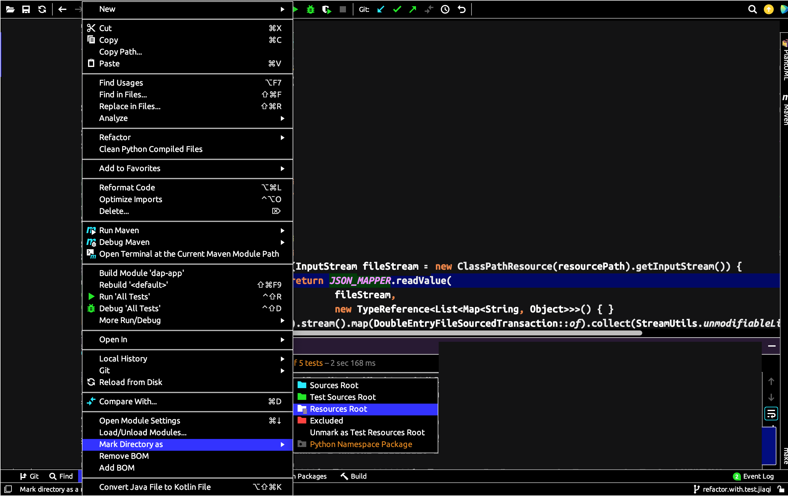

离线转译 web 服务
================

![Java Version Badge][Java Version Badge]
[![Screwdriver Badge][Screwdriver Badge]][Screwdriver URL]

业务流程图
----------

    

开发指南
--------

### 获取代码

#### IntelliJ 配置自动代码风格

目前，我们制定并完善了本项目的代码风格配置，并将其作为IntelliJ设置。如果使用IntelliJ作为IDE，我们可以通过导入仓库根目录中的[jersey-webservice-template-Project-intellij-code-style.xml][style config]文件来导入这些代码样式设置。项目设置将作为名为“jersey-webservice-template-Project”的新方案出现在IDE的**Editor** -> **Code Style**部分下。

请同时启用“移除未使用的导入”功能，通过**Editor** -> **General** -> **Auto Import** -> **Optimize Imports on the Fly**，它将自动移除未使用的导入。

##### IntelliJ问题解决

###### IntelliJ无法读取资源文件

当我们在IntelliJ中运行单元测试时，有时会遇到错误，提示“某个资源文件”无法找到。我们知道路径绝对正确。如果是这种情况，这只是IntelliJ的问题，通过明确告诉IntelliJ这些资源的位置来解决：

###### 制表符宽度

我们使用4个空格作为制表符。这可以在**Code Style** -> **Java** -> **Tabs and Indents**中进行配置，设置如下：

Tab size: 4
Indent: 4
Continuation indent: 8

如果按下TAB或Enter时制表符仍然以2个空格出现，而不是4个空格，请尝试：

1. “Settings | Editor | Code Style” -- 如果启用了“Detect and use existing file indents for editing”，请尝试禁用它（默认是启用的）。注意：可能需要重新打开编辑器中的文件。
2. 在你的文件路径中是否有任何.editorconfig文件？来自.editorconfig的设置（“Settings | Editor | Code Style”）具有优先级（将覆盖）你的IDE设置。

### 打包编译

### 本地启动

[Java Version Badge]: https://img.shields.io/badge/Java-17-brightgreen?style=for-the-badge&logo=OpenJDK&logoColor=white
[Screwdriver URL]: https://ci-cd.paion-data.dev/pipelines/4/events
[Screwdriver Badge]: https://img.shields.io/badge/Screwdriver%20流水线-1475BB?style=for-the-badge&logo=data:image/svg+xml;base64,PD94bWwgdmVyc2lvbj0iMS4wIiBlbmNvZGluZz0iaXNvLTg4NTktMSI/Pg0KPCEtLSBVcGxvYWRlZCB0bzogU1ZHIFJlcG8sIHd3dy5zdmdyZXBvLmNvbSwgR2VuZXJhdG9yOiBTVkcgUmVwbyBNaXhlciBUb29scyAtLT4NCjxzdmcgaGVpZ2h0PSI4MDBweCIgd2lkdGg9IjgwMHB4IiB2ZXJzaW9uPSIxLjEiIGlkPSJMYXllcl8xIiB4bWxucz0iaHR0cDovL3d3dy53My5vcmcvMjAwMC9zdmciIHhtbG5zOnhsaW5rPSJodHRwOi8vd3d3LnczLm9yZy8xOTk5L3hsaW5rIiANCgkgdmlld0JveD0iMCAwIDUxMiA1MTIiIHhtbDpzcGFjZT0icHJlc2VydmUiPg0KPHBhdGggc3R5bGU9ImZpbGw6I2ZmZmZmZjsiIGQ9Ik01MDQuNzgzLDc3LjA5MWgtMC4wMDZIMzAzLjQ5NGMtMi4wMzYsMC0zLjk3NywwLjg1OS01LjM0NSwyLjM2Ng0KCWMtMS4zNjgsMS41MDgtMi4wMzgsMy41Mi0xLjg0Miw1LjU0OWwzLjkyNSw0MC42OTNjMC4zNDMsMy41NTIsMy4yMjgsNi4zMiw2Ljc5Miw2LjUxNmw0Mi4wNSwyLjMxNGwtODAuNzM2LDExMi4wMjNMMTgwLjI5Myw3MS4xNDINCglsNjMuNTYzLTIuNDNjMy44NDQtMC4xNDYsNi44OTYtMy4yNzYsNi45NDUtNy4xMjFsMC40NjQtMzYuMzkyYzAuMDIyLTEuOTMyLTAuNzI2LTMuNzkyLTIuMDgyLTUuMTY2DQoJYy0xLjM1Ni0xLjM3Mi0zLjIwNi0yLjE0Ny01LjEzNy0yLjE0N0g3LjIyYy0zLjk4OSwwLTcuMjIsMy4yMzEtNy4yMiw3LjIyMXY0MC41NThjMCwzLjk0NywzLjE3LDcuMTYzLDcuMTE1LDcuMjJsNjYuOTE3LDAuOTY0DQoJbDEyNy4yNTcsMjI0LjQ4OGwtMC41NjgsMTQwLjIwNWwtODguNDgsMy42MzFjLTMuODE3LDAuMTU1LTYuODUsMy4yNTktNi45MjMsNy4wNzdsLTAuNzE2LDM3LjUwNg0KCWMtMC4wMzcsMS45MzksMC43MDksMy44MSwyLjA2OSw1LjE5NmMxLjM1NiwxLjM4MywzLjIxMiwyLjE2MSw1LjE1MSwyLjE2MWgyNzYuNzYyYzEuOTgxLDAsMy44NzUtMC44MTMsNS4yMzktMi4yNDkNCgljMS4zNjMtMS40MzUsMi4wNzgtMy4zNjgsMS45NzQtNS4zNDZsLTEuOTMzLTM3LjEzMmMtMC4xOTItMy42OTItMy4xNC02LjY0MS02LjgzNS02LjgzNGwtNzYuMTI0LTMuOTkybC0xMS4wODItMTM2LjU3DQoJTDQzNi40NzksMTM3LjMzbDU1LjY0LTIuNTNjMy4wNjMtMC4xNDIsNS43MDQtMi4yMDIsNi41ODctNS4xMzlsMTIuOTA5LTQzLjAxOGMwLjI0OC0wLjcyOSwwLjM4NS0xLjUxNiwwLjM4NS0yLjMzMg0KCUM1MTIsODAuMzI1LDUwOC43NzIsNzcuMDkxLDUwNC43ODMsNzcuMDkxeiIvPg0KPC9zdmc+
